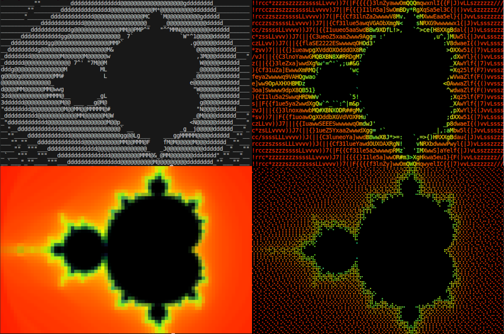

# Unicode Art
### The better ascii art

## Examples
#### Images
```
uniart mandelbrot.png
uniart mandelbrot.png -m luminance -tbfq
uniart mandelbrot.png -tbf -m double-pixels
uniart mandelbrot.png -tbf -m braille
```

Each image is a screenshot of a text terminal.

#### Animations
```
uniart mandelbrot.gif
uniart mandelbrot.gif -m luminance -tbf
uniart mandelbrot.gif -tbf -m double-pixels
uniart mandelbrot.gif -tbf -m braille
```
